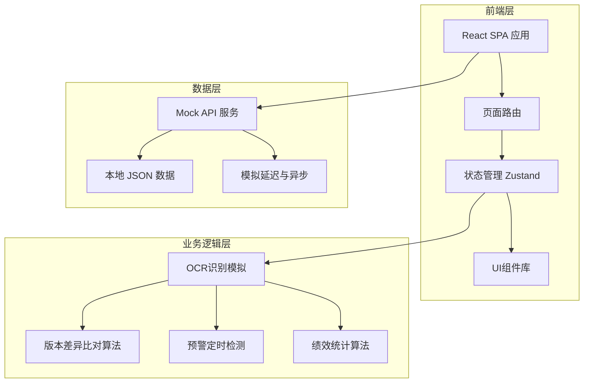

## 1. 架构设计



## 2. 技术说明

- **前端框架**：React@18 + TypeScript
- **样式方案**：Tailwind CSS@3 + CSS Modules（用于自定义主题变量）
- **构建工具**：Vite
- **路由**：React Router@6
- **状态管理**：Zustand（轻量级，适合中型应用）
- **图表库**：Recharts（用于绩效对比报表、雷达图、柱状图）
- **图标库**：Lucide React
- **动画**：Framer Motion
- **后端**：无独立后端，使用Mock数据模拟API
- **数据库**：无真实数据库，使用本地JSON文件模拟数据持久化

## 3. 路由定义

| 路由 | 用途 | 访问角色 |
|------|------|----------|
| `/` | 重定向到工作台 | 全部 |
| `/dashboard` | 工作台首页 | 全部 |
| `/manuscripts` | 古籍影像管理 | 数字化工程师 |
| `/manuscripts/:id` | 古籍详情（OCR结果与补录） | 数字化工程师 |
| `/proofread` | 校勘工作台 | 校勘专家 |
| `/proofread/:id` | 校勘比对视图 | 校勘专家 |
| `/review` | 审校复核列表 | 审校员 |
| `/review/:id` | 复核操作 | 审校员 |
| `/library` | 电子古籍库 | 全部 |
| `/library/:id` | 古籍详情阅读 | 全部 |
| `/admin/standards` | 质量标准设置 | 管理员 |
| `/admin/cycles` | 校勘周期管理 | 管理员 |
| `/admin/monitor` | 进度监控看板 | 管理员 |
| `/admin/alerts` | 预警管理 | 管理员 |
| `/performance` | 绩效统计 | 管理员 |
| `/messages` | 消息中心 | 全部 |

## 4. API 定义

### 4.1 数据类型定义

```typescript
type UserRole = 'engineer' | 'proofreader' | 'reviewer' | 'admin'

interface User {
  id: string
  name: string
  role: UserRole
  avatar: string
  phone: string
}

interface Manuscript {
  id: string
  title: string
  author: string
  dynasty: string
  totalPages: number
  status: 'uploading' | 'ocr_processing' | 'pending_supplement' | 'proofreading' | 'reviewing' | 'completed'
  createdAt: string
  updatedAt: string
}

interface ManuscriptPage {
  id: string
  manuscriptId: string
  pageNumber: number
  imageUrl: string
  ocrText: string
  ocrConfidence: number
  needsSupplement: boolean
  supplementedText: string
  status: 'pending_ocr' | 'ocr_done' | 'supplementing' | 'supplemented'
}

interface ProofreadRecord {
  id: string
  manuscriptId: string
  expertId: string
  expertName: string
  pageNumber: number
  originalText: string
  correctedText: string
  differenceType: 'wrong_char' | 'missing_char' | 'extra_char' | 'derivative'
  note: string
  createdAt: string
}

interface ProofreadSubmission {
  id: string
  manuscriptId: string
  expertId: string
  expertName: string
  totalPages: number
  status: 'pending_review' | 'approved' | 'rejected'
  reviewNote: string
  reviewerId: string
  reviewerName: string
  reviewedAt: string
  createdAt: string
}

interface VersionDiffReport {
  id: string
  submissionId: string
  manuscriptId: string
  diffs: DiffItem[]
  generatedAt: string
}

interface DiffItem {
  pageNumber: number
  originalText: string
  correctedText: string
  diffType: string
}

interface ElectronicBook {
  id: string
  manuscriptId: string
  bookNumber: string
  title: string
  lockedAt: string
  lockedBy: string
  version: number
}

interface QualityStandard {
  manuscriptId: string
  maxErrorRate: number
  minOcrConfidence: number
}

interface ProofreadCycle {
  manuscriptId: string
  startDate: string
  endDate: string
  plannedDays: number
  currentProgress: number
  isOverdue: boolean
  overduePercentage: number
}

interface PerformanceRecord {
  expertId: string
  expertName: string
  date: string
  completedPages: number
  passRate: number
  avgProcessingTime: number
}

interface Message {
  id: string
  type: 'upload' | 'proofread_submit' | 'review_approved' | 'review_rejected' | 'alert'
  title: string
  content: string
  targetUserId: string
  relatedManuscriptId: string
  relatedTaskId: string
  isRead: boolean
  hasVoucher: boolean
  voucherUrl: string
  createdAt: string
}

interface TaskProgress {
  manuscriptId: string
  manuscriptTitle: string
  currentAssignee: string
  currentRole: UserRole
  status: string
  plannedDuration: number
  elapsedDuration: number
  progressPercentage: number
  isAlerted: boolean
}
```

### 4.2 Mock API 端点

| 方法 | 路径 | 描述 |
|------|------|------|
| GET | `/api/manuscripts` | 获取古籍列表 |
| GET | `/api/manuscripts/:id` | 获取古籍详情 |
| POST | `/api/manuscripts/:id/upload` | 上传影像 |
| GET | `/api/manuscripts/:id/pages` | 获取页面OCR结果 |
| PUT | `/api/manuscripts/:id/pages/:pageId/supplement` | 人工补录 |
| GET | `/api/proofread/tasks` | 获取校勘任务列表 |
| GET | `/api/proofread/tasks/:id` | 获取校勘任务详情 |
| POST | `/api/proofread/tasks/:id/submit` | 提交校勘记录 |
| GET | `/api/proofread/submissions/:id/diff-report` | 获取版本差异报告 |
| GET | `/api/review/pending` | 获取待复核列表 |
| POST | `/api/review/submissions/:id/approve` | 审核通过 |
| POST | `/api/review/submissions/:id/reject` | 审核退回 |
| GET | `/api/library` | 获取电子古籍库 |
| GET | `/api/library/:id` | 获取电子古籍详情 |
| GET | `/api/admin/standards` | 获取质量标准 |
| PUT | `/api/admin/standards/:manuscriptId` | 更新质量标准 |
| GET | `/api/admin/cycles` | 获取校勘周期 |
| PUT | `/api/admin/cycles/:manuscriptId` | 更新校勘周期 |
| GET | `/api/admin/monitor` | 获取任务进度 |
| GET | `/api/admin/alerts` | 获取预警列表 |
| GET | `/api/performance` | 获取绩效数据 |
| GET | `/api/messages` | 获取消息列表 |
| PUT | `/api/messages/:id/read` | 标记消息已读 |

## 5. 数据模型

### 5.1 数据模型关系图

```mermaid
erDiagram
    "User" ||--o{ "ProofreadSubmission" : "submits"
    "User" ||--o{ "Message" : "receives"
    "Manuscript" ||--o{ "ManuscriptPage" : "contains"
    "Manuscript" ||--o{ "ProofreadSubmission" : "has"
    "Manuscript" ||--o{ "ElectronicBook" : "produces"
    "Manuscript" ||--|{ "QualityStandard" : "configured_by"
    "Manuscript" ||--|{ "ProofreadCycle" : "scheduled_by"
    "ProofreadSubmission" ||--o{ "ProofreadRecord" : "contains"
    "ProofreadSubmission" ||--|{ "VersionDiffReport" : "generates"
    "User" {
        "string id PK"
        "string name"
        "UserRole role"
        "string avatar"
        "string phone"
    }
    "Manuscript" {
        "string id PK"
        "string title"
        "string author"
        "string dynasty"
        "int totalPages"
        "ManuscriptStatus status"
    }
    "ManuscriptPage" {
        "string id PK"
        "string manuscriptId FK"
        "int pageNumber"
        "string imageUrl"
        "string ocrText"
        "float ocrConfidence"
        "boolean needsSupplement"
    }
    "ProofreadRecord" {
        "string id PK"
        "string manuscriptId FK"
        "string expertId FK"
        "int pageNumber"
        "string originalText"
        "string correctedText"
        "DiffType differenceType"
    }
    "ProofreadSubmission" {
        "string id PK"
        "string manuscriptId FK"
        "string expertId FK"
        "SubmissionStatus status"
        "string reviewNote"
    }
    "ElectronicBook" {
        "string id PK"
        "string manuscriptId FK"
        "string bookNumber"
        "int version"
    }
    "QualityStandard" {
        "string manuscriptId PK_FK"
        "float maxErrorRate"
        "float minOcrConfidence"
    }
    "ProofreadCycle" {
        "string manuscriptId PK_FK"
        "string startDate"
        "string endDate"
        "boolean isOverdue"
    }
    "PerformanceRecord" {
        "string expertId FK"
        "string date"
        "int completedPages"
        "float passRate"
        "float avgProcessingTime"
    }
    "Message" {
        "string id PK"
        "MessageType type"
        "string targetUserId FK"
        "boolean isRead"
    }
```
